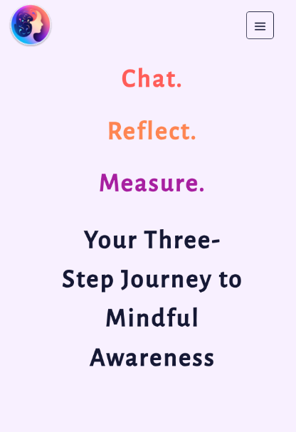

# MindMate

_Find the site being hosted at:_
[https://mind-mate-eight.vercel.app/]([https://mind-mate-eight.vercel.app/)

## Contributors
[Saba Oji](https://github.com/SabaO7)
[Nick Ferracuti](https://github.com/NFerracuti)
[William Kemeny](https://github.com/williamkemeny)
[Steven Han](https://github.com/sthan3990)

## _Revolutionizing Mental Health Journaling with AI_:

_Discover a transformative approach to mental health with MindMate, an app that combines the art of journaling with the insights of cognitive behavioral therapy (CBT) through an AI chatbot powered by OpenAI's API. This innovative platform provides a conversational journaling experience, where users engage in meaningful dialogues with an AI therapist trained in CBT techniques._

_MindMate's chat interface makes journaling an interactive, guided process. The AI chatbot helps users explore their thoughts and emotions in depth, offering CBT-based prompts and responses. This unique method facilitates self-discovery and emotional growth in a supportive, user-friendly environment._

_In addition to its interactive journaling feature, MindMate excels in tracking and presenting mental health progress. The app analyzes your conversations and provides insightful data, enabling you to monitor your journey and recognize patterns in your emotional well-being over time. This empowers users with a clear view of their personal growth and the effectiveness of their journaling practice._

_MindMate is more than just an app; it's a companion in your journey towards better mental health, offering a blend of technology and therapy techniques to support your path to self-improvement._

## Tech Stack
**MindMate** is _full-stack application_ that uses `Typescript`, `PostgreSQL` relational database system, and `Next.js` on top of `React.js` frameworks. Front-end has been build using `Chakra UI`.

<p align="center">
  <a href="https://skillicons.dev">
    
  </a>
</p>


## To Run Locally

First, run the development server:

```bash
npm run dev
# or
yarn dev
# or
pnpm dev
```
> Note: Node V16 or greater is required to run the project.

Open [http://localhost:3000](http://localhost:3000) with your browser to see the result.

## :triangular_flag_on_post: Getting Started

Clone the repo onto your local device. 

## :dart: Features

### Feature: Authentication
Users can sign up for an account to access the app's features.
Users can log in to their account to access personal data and use the app.
Users can log out of the app to ensure their information is secure.

### Feature: Account Management
Users can change their username or email address to keep their information up to date.
Users can access an account tab to manage personal settings in one place.

### Feature: Guided Journal
Users can view their past journal entries to reflect on previous thoughts and feelings. (WIP)
Users can start a new journal session by selecting the number of prompts to control the depth of their journaling experience.
Users can express current emotions using an emoji, allowing the AI to generate appropriate prompts for the journaling session.
Users can interact with a chat interface for a guided journaling experience, responding to prompts.
Users can view a motivational message after completing a journaling session, ending the experience on a positive note.

### Feature: CBT Chatbot
Users can have a conversation with a CBT (Cognitive Behavioral Therapy) chatbot to work through thoughts and feelings without predefined prompts.
Users can view a motivational message after their chat session to maintain a positive mindset.

### Feature: Progress Report
Users can view a report of their average journaling activity to understand usage patterns and engagement with the journaling process.
Users can view a calendar report showing the frequency of their conversations to track consistency and dedication to mental wellness practices.
Users can see a graphical report of their interactions over time to visualize engagement level and progress.
 
## App Feature Screenshots

- User Registration


- User Landing Page


- Guided Journal first step - select number of questions during journaling session


- Guided Journal second step - select how you are currently feeling


- Cognitive Behavioural Therapy Chatbot


- User Progress option - Pie Charts


- Mobile Responsive



- Mobile Responsive Drawer


## :traffic_light: Dependencies
  ```
    "ai": "^2.2.20",
    "axios": "^1.6.0",
    "bcrypt": "^5.1.1",
    "eslint": "8.43.0",
    "eslint-config-next": "13.4.6",
    "framer-motion": "^10.16.4",
    "lodash": "^4.17.21",
    "next": "^13.4.6",
    "node-fetch": "^3.3.2",
    "openai": "^4.14.2",
    "papaparse": "^5.4.1",
    "react": "18.2.0",
    "react-dom": "18.2.0",
    "recharts": "^2.9.2",
    "sass": "^1.69.5",
    "typescript": "5.1.3",
    "@chakra-ui/icon": "^3.2.0",
    "@chakra-ui/icons": "^2.1.1",
    "@chakra-ui/next-js": "^2.1.4",
    "@chakra-ui/react": "^2.8.1",
    "@emotion/react": "^11.11.1",
    "@emotion/styled": "^11.11.0",
    "@types/node": "20.3.1",
    "@types/papaparse": "^5.3.10",
    "@types/react": "18.2.13",
    "@types/react-dom": "18.2.6",
    "@vercel/postgres": "^0.5.0"

  ```

## Thank you for your interest!

------------------------------------------------------------------------------------------------